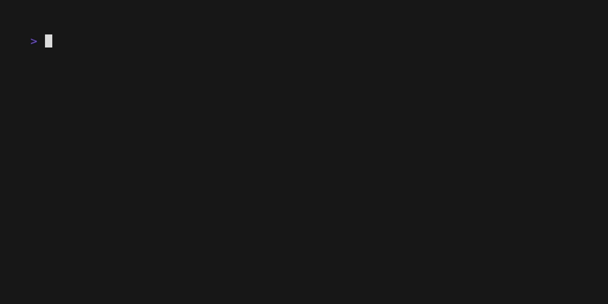

# Silos

Dumb, proomptable modular snippet search.



## Installation

### Binary releases

There are no binary releases yet.

### From source

Prerequisites:

- libc
- [rust toolchain](https://rustup.rs)

Clone this repository and build it.

``` sh
cargo install --git https://github.com/lavafroth/silos
```

## Editor support

- Helix: Use the example `.helix` directory provided to run the LSP for files under `./examples/`.
- Neovim: Please follow [the official guide](https://neovim.io/doc/user/lsp.html).
- VSCode: Use the [vscode-lspconfig](https://marketplace.visualstudio.com/items?itemName=whtsht.vscode-lspconfig) extension with the `.vscode/settings.json` provided.

Make sure to modify the binary path in the example to where you have it on your system.

## Usage

- Write a comment above a paragraph of code, consider the example in examples/example.go

``` go
  resumeFilename := "resume.pdf"
  version := 3
  // refactor: change the file basename to that of the parent
  whereIsMyResume :=
    filepath.Base(
      documentsDirectory + "CV" + "_v" + strconv.Itoa(version) + "/" + resumeFilename)
```

- The comment must begin with either of
  - `generate: `
  - `refactor: `
- Select the code to be modified along with the comment above it.
- Trigger code actions. In helix, this is `space`, `a`.
- Select the option called "ask silos."

> [!NOTE]
>
> Embedding defaults to using the CPU. You may use the `--gpu` flag with a GPU number to use a dedicated GPU.

## `generate` snippets

- Stored in the KDL format inside per-language directories under `./snippets/v1`.
- They must conform to the following structure

``` kdl
desc "describes the snippet"
body #"the snippet itself"#
```

KDL supports arbitrary raw strings with as many `#`s before and after the quotes to disambiguate them from the string contents.

See the example snippet `./snippets/v1/go/simple_worker.kdl` in the go programming language.

## `refactor` snippets

This API parses code into an AST (Abstract Syntax Tree) via tree-sitter and can perform subsequent mutations.

### Supported Languages

- C
- Rust
- Go
- Javascript
- C++

### Defining mutation collections

``` kdl
description "describes the mutation collection"
mutation {
  expression "some ((beautiful) @adjective) AST expression"
  substitute {
    literal "hello"
    capture "adjective"
    literal "world"
  }
}

mutation {
  expression "another"
  substitute {
    literal "multiple mutations work"
    literal "as long as their expression"
    literal "don't collide"
  }
}
```

- `description`: A textual description of the mutation collection.
- `mutation`:  Defines individual code changes.
  - `expression`: Uses tree-sitter to match and capture AST nodes with `@` prefixes, The special `@root` node is reserved for the entire expression.
  - `substitute`:  Constructs the modified code using literals and captured arguments.

See the example mutation collection in `./snippets/v2/go/mutations.kdl`.

- The API performs a single-pass substitution based on the closest matching mutation.
- Captured groups are used within the `substitute` block and the mutated code is returned.

**Further reading**

- [tree-sitter query snytax](https://tree-sitter.github.io/tree-sitter/using-parsers/queries/1-syntax.html) to create mutation expressions.
